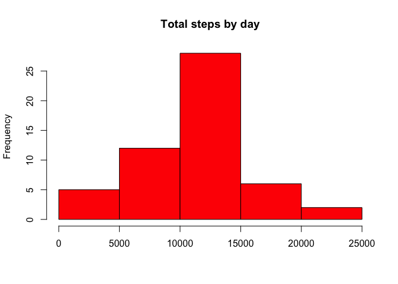
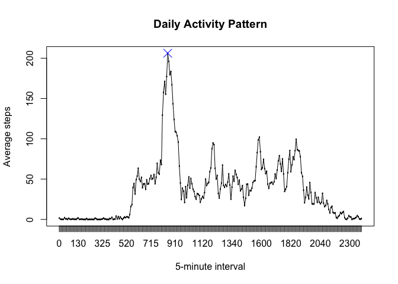
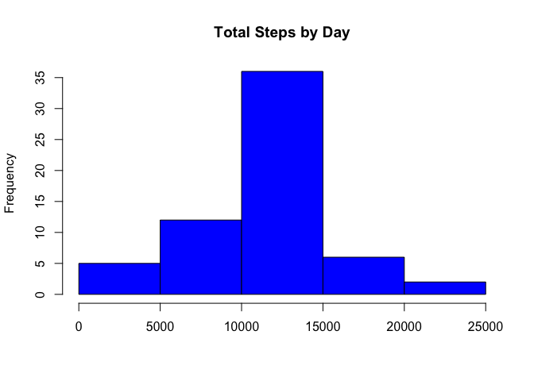
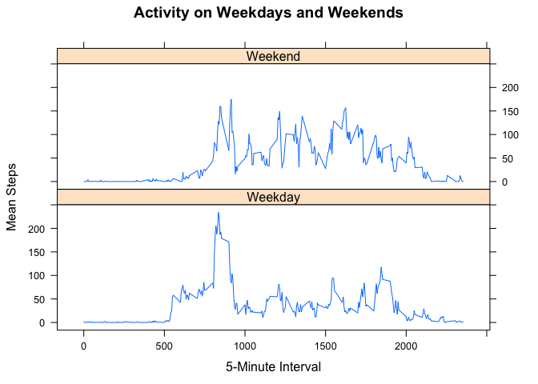

# Reproducible Research: Peer Assessment 1
Eric Weber  
## Global settings

```r
echo = TRUE
```
## Loading and preprocessing the data

```r
setwd("/Users/ericweber/GitHub/datasciencecoursera/DataScience5ReprodResearch/RepData_PeerAssessment1")
unzip(zipfile="activity.zip")
data <- read.csv(file="activity.csv")
data$date <- as.Date(data$date)
summary(data)
```

```
##      steps             date               interval     
##  Min.   :  0.00   Min.   :2012-10-01   Min.   :   0.0  
##  1st Qu.:  0.00   1st Qu.:2012-10-16   1st Qu.: 588.8  
##  Median :  0.00   Median :2012-10-31   Median :1177.5  
##  Mean   : 37.38   Mean   :2012-10-31   Mean   :1177.5  
##  3rd Qu.: 12.00   3rd Qu.:2012-11-15   3rd Qu.:1766.2  
##  Max.   :806.00   Max.   :2012-11-30   Max.   :2355.0  
##  NA's   :2304
```

## What is mean total number of steps taken per day?
We construct a histogram to show total number of steps taken per day, then find the mean and median for steps taken per day.


```r
library(lattice)
totsteps <- aggregate(steps ~ date, data = data, sum, na.rm = TRUE)
```

The histogram is as follows:

```r
hist(totsteps$steps, main = "Total steps by day", xlab = "", col="red")
```

 

The number of mean steps per day is 1.0766189\times 10^{4}, and the median steps per day is 10765.

## What is the average daily activity pattern?

```r
transform<-list(as.factor(data$interval))
byfives<- aggregate(data$steps, transform, mean, na.rm=T)
names(byfives) <- c("interval", "mn")

plot(byfives$interval, byfives$mn, type = "l", xlab = "5-minute interval", main = "Daily Activity Pattern", ylab = "Average steps")
lines(byfives$interval, byfives$mn)
maxpt<-byfives[which(byfives$mn == max(byfives$mn)), ]
points (maxpt, pch=4, cex=2, col="blue")
```

 

Based on this information, the five minute interval with max steps on average across all of the days is 835 which had 206.1698113 average steps. 

## Imputing missing values

The number of rows with missing data (recorded as NAs) is 2304.

In the next part of the activity, we replace the missing values (NAs) with the mean in that five minute interval. 


```r
stepavg<- aggregate(steps~interval, data = data, FUN = mean)
repNA<- numeric()
for (i in 1:nrow(data)){
        temp <- data[i,]
        if (is.na(temp$steps)){
                steps<-subset(stepavg, interval == temp$interval)$steps
        }
        else{
                steps<-temp$steps
        }
        repNA<-c(repNA, steps)
}
```

Next, we create a new dataset with the missing data filled in according to the procedure above.


```r
new_data<- data
new_data$steps <- repNA
```
Now, the number of rows with missing data (recorded as NAs) is 0.

Lastly, we create a histogram showing the total number of steps taken each day.

```r
newtotal<- aggregate(steps~date, data = new_data, sum, na.rm = TRUE)
hist(newtotal$steps, main = "Total Steps by Day", xlab="", col = "blue")
```

 

The number of mean steps per day is 1.0766189\times 10^{4}. The number of median steps per day is 1.0766189\times 10^{4}. The mean and median are nearly the same as those in the first part of the assignment.

## Are there differences in activity patterns between weekdays and weekends?
To answer this question, we create a new factor variable in the dataset with two levels – “weekday” and “weekend”, indicating whether a given date is a weekday or weekend day. We then
display a time series plot of the five minute intervals, the average number of steps taken, averaged across all weekday days or weekend days. 


```r
library(lattice)
day <- weekdays(data$date)
daytype <- vector()
for (i in 1:nrow(data)) {
    if (day[i] == "Saturday") {
        daytype[i] <- "Weekend"
    } else if (day[i] == "Sunday") {
        daytype[i] <- "Weekend"
    } else {
        daytype[i] <- "Weekday"
    }
}
data$daytype <- daytype
data$daytype <- factor(data$daytype)

stepsByDay <- aggregate(steps ~ interval + daytype, data = data, mean)
names(stepsByDay) <- c("interval", "daytype", "steps")

xyplot(steps ~ interval |daytype, data=stepsByDay, type="l", layout=c(1, 2), xlab="5-Minute Interval", ylab="Mean Steps", main = "Activity on Weekdays and Weekends")
```

 

These figures show that activity on the weekends takes place later in the day than it does on weekdays. However, there is a large spike in steps in the early morning on weekdays, suggesting the person walks to work or goes to the gym regularly, but does not do so on the weekends. Finally, the activity seems more even on the weekends than in the weekdays, where the steps seem to be clustered around certain times of day. 
